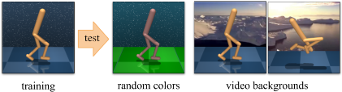

# Install CARLA Simulator
Download and extract the Carla version 0.9.14 for your specific OS:
https://github.com/carla-simulator/carla/releases/tag/0.9.14/

[Optional] Download the additional maps package for the Carla version 0.9.14 for your specific OS.

# To start CARLA Simulator
1. Go into /CARLA_0.9.14 folder
2. launch the simulator, for Ubuntu type in a terminal the line:
	./CarlaUE4.sh
3. To navigate in the simulator window use "ASDW" keys and the mouse

# How to solve some error after launching the server app:
E: error while loading shared libraries: libomp.so.5: cannot open shared object file: No such file or directory <br>
S: sudo apt-get install libomp5

# Overview


## Install SGQN
We assume that you have access to a GPU with CUDA >=9.2 support. All dependencies can then be installed with the following commands:

```
conda env create --file setup/sgqn-carla.yml
conda activate sgqn-carla
sh setup/install.sh
```

# Run `SGQN` training:
```bash
python src/train.py --algorithm sgsac --sgqn_quantile [QUANTILE] --seed [SEED] --eval_mode video_easy --domain_name [DOMAIN] --task_name [TASK];
```
You can also run `SVEA`, `SODA`, `RAD`, `SAC`.


# DMControl Generalization Benchmark

Benchmark for generalization in continuous control from pixels, based on [DMControl](https://github.com/deepmind/dm_control).

## Test environments

The DMControl Generalization Benchmark provides two distinct benchmarks for visual generalization, *random colors* and *video backgrounds*:



Both benchmarks are offered in *easy* and *hard* variants. Samples are shown below.

**video_easy**<br/>


**video_hard**<br/>


